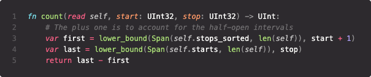
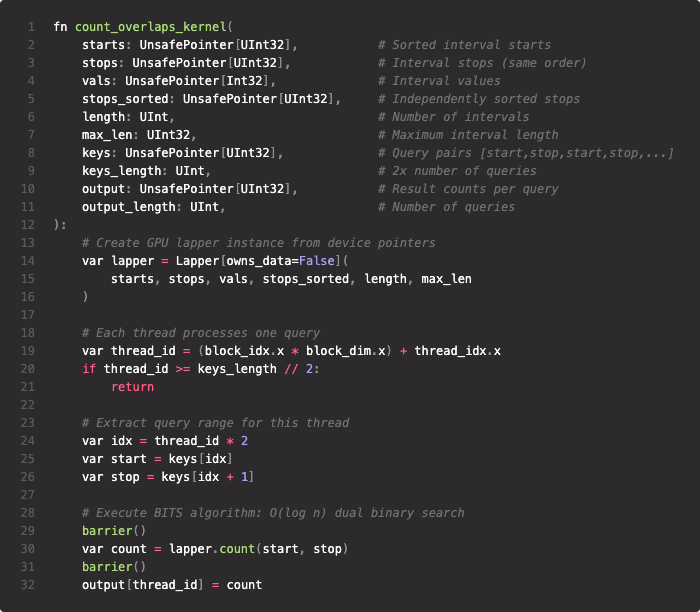

  

# Mojo-Lapper

## Modular Community Meeting
### July 14, 2025

Seth Stadick  - `seth_stadick@bio-rad.com`

> https://github.com/sstadick/mojo-lapper

  

  

  

---

# Overview

- Implementation of the Binary Interval Search (BITS) algorithm.

https://arxiv.org/abs/1208.3407

---

# BITS provides a fast count of overlapped intervals

- Sorted list of start positions
- Sorted list of end positions
- Binary search (lower bound) for query end against starts
- Binary search (lower bound) for query start against ends 
- Diff is the count of the intervals the query overlaps

---

  

# Moving it to the GPU

- Original BITS paper includes a Cuda implementation, but no 1:1 bechmarks vs the CPU
- I didn't expect it to perform that well given the likely memory access pattern of binary search

  

  

  

---

# Performance vs Enumeration

| Operation | CPU (ms) | GPU (ms) | Speedup GPU vs CPU |
|-----------|----------|----------|---------|
| Count overlaps (BITS) | 1.12 | 0.008 | 140x |
| Count overlaps (Naive) | 10.89 | 0.11 | 99x |

---

  

# Orchestration

- Dynamic scheduling, just launch all the threads
  - https://arxiv.org/abs/2506.01576
- Thread per query, queries are sorted

  

  

  

---

# Takeaways

- Just try running your algorithm on the GPU
- The barrier to entry has never been lower
- The design spaced around GPU/CPU data structures is going to be cool*

> It might already be cool and I just don't know because I don't write Cuda

---

# Further work

- Construct sorted arrays on GPU with radix sort
- Switch to static B-tree / S-tree layout for better memory access pattern:
  - https://en.algorithmica.org/hpc/data-structures/s-tree
  - https://curiouscoding.nl/posts/static-search-tree/

---

# Questions?

Thank you!

---

# Appendix

---

# Work since hackathon

- Adding a SIMD version of the `find` method
  - Theoretically faster
- Adding CLI tool for benchmarking in biofast repo